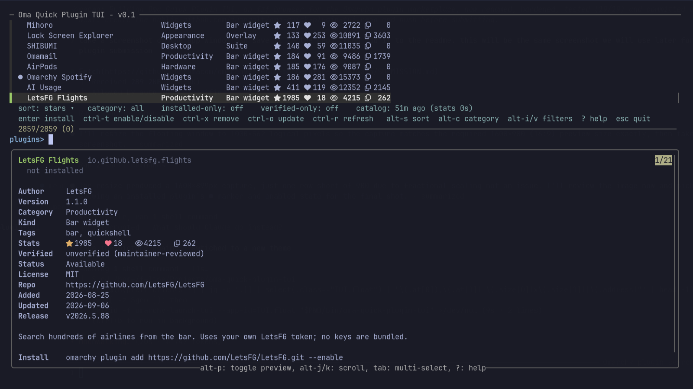

# Oma Quick Plugin TUI

A terminal UI for the [Omarchy plugin marketplace](https://plugins.omarchy.org),
in the same style as Omarchy's *Install → AUR* picker: fuzzy search, a details
pane, and one keypress to install.



- **Search** by name, id, author or tag
- **Filter** by category (Widgets, Productivity, System, Hardware, …), installed-only, verified-only
- **Sort** by GitHub stars, hearts, views, copies, recently added, recently updated, or name
- **Install / enable / disable / update / remove** plugins through the regular `omarchy plugin` commands
- One 7 MB download, cached for 6 hours — no per-repository requests

It is a single bash script on top of `fzf`, `jq`, `curl` and `gum`, all of which
ship with Omarchy.

## Install

```bash
omarchy plugin add https://github.com/juangalt/oma-quick-plugin-tui.git --enable
```

Enabling the plugin adds a **Oma Quick Plugin TUI** entry to the app launcher
(`SUPER + SPACE`). You can also run it directly:

```bash
~/.config/omarchy/plugins/juangalt.oma-quick-plugin-tui/bin/oma-quick-plugin-tui
```

### Omarchy menu entry (optional)

To get an *Install → Plugins* row right after *Install → TUI*, add this to
`~/.config/omarchy/extensions/omarchy-menu.jsonc` (the menu hot-reloads; 󰐱 is
the same Nerd Font puzzle glyph Omarchy uses for its own plugin menu):

```jsonc
"install.plugins": {"icon":"󰐱","label":"Plugins","action":"omarchy-launch-tui --app-id=TUI.float ~/.config/omarchy/plugins/juangalt.oma-quick-plugin-tui/bin/oma-quick-plugin-tui"},
```

### Keybinding (optional)

In `~/.config/hypr/bindings.lua` (check the key is free first with
`omarchy menu keybindings --print`):

```lua
o.bind("SUPER + SHIFT + CTRL + P", "Plugins",
  "omarchy-launch-tui --app-id=TUI.float $HOME/.config/omarchy/plugins/juangalt.oma-quick-plugin-tui/bin/oma-quick-plugin-tui")
```

The window uses the `TUI.float` app-id, so Omarchy floats and centres it like
its other TUIs (Disk Usage, Docker, …).

## Keys

Navigation and filters live on `alt`, actions on `ctrl` (plus `enter`).

| Key | Action |
|-----|--------|
| type | fuzzy search over name, id, author and tags |
| `tab` | multi-select |
| `home` / `end` | jump to the top / bottom of the list |
| `alt-s` / `alt-S` | cycle sort (stars → hearts → views → copies → added → updated → name) / pick sort from a list |
| `alt-c` / `alt-C` | cycle category / pick category from a list |
| `alt-i` | toggle installed-only |
| `alt-v` | toggle verified-only |
| `alt-p` | toggle the details pane; `alt-j`/`alt-k`/`alt-d`/`alt-u` scroll it |
| `alt-o` | open the plugin's repository in the browser |
| `alt-h` or `?` | help popup (`esc` closes it) |
| `enter` | install selected plugin(s) — runs `omarchy plugin add <repo> --enable` |
| `ctrl-t` | enable / disable an installed plugin |
| `ctrl-x` | remove an installed plugin |
| `ctrl-o` | update an installed plugin |
| `ctrl-r` | re-download catalog and stats |
| `esc` or `ctrl-q` | quit (`ctrl-c` and `ctrl-g` are ignored; `ctrl-d` just deletes a character) |

When you change the sort, category or a filter, the corresponding value in the
header lights up for about a second so the change is easy to spot.

In the list, `●` marks an enabled plugin and `○` one that is installed but disabled.

Install, remove and update go through the official `omarchy plugin` commands
with their normal confirmations (the untrusted-code warning, the bar-section
picker for bar widgets, the update diff). Set `OMA_QUICK_PLUGIN_TUI_YES=1` or pass
`--yes` to skip them when batch-installing.

## Data

| Source | What | Cache |
|--------|------|-------|
| `https://plugins.omarchy.org/catalog.json` | names, categories, tags, stars, verification, install command | 6 h |
| `https://api.omarchyplugins.com/v1/stats` | hearts, views, copies | 15 min |

Cache lives in `~/.cache/oma-quick-plugin-tui/`. If a download fails the last
cached copy is used and the header says so. Installed state comes from
`omarchy plugin list --json` on every reload.

## Security / what it touches

The tool runs as your user, needs no root, ships no binaries and sends no
telemetry. Everything it does:

- **Two HTTPS GETs**: `https://plugins.omarchy.org/catalog.json` and
  `https://api.omarchyplugins.com/v1/stats`, with curl pinned to HTTPS
  (`--proto =https --proto-redir =https`), at most 3 redirects and a 64 MB size
  cap. A download is only accepted once it parses as JSON with a `plugins` key.
- **A cache directory**: `~/.cache/oma-quick-plugin-tui/` (catalog, stats, and
  the derived TSV/NDJSON files).
- **A private per-run state directory** under `$XDG_RUNTIME_DIR` (`mktemp -d`,
  mode 0700, removed on exit) holding the sort/filter state file and fzf's
  unix socket. fzf's action endpoint listens on that socket only — no TCP
  port — and requires a random per-run API key; the tool uses it for one
  thing, refreshing the header after the highlight timeout.
- **One `.desktop` file**: while the plugin is enabled, the service writes
  `~/.local/share/applications/juangalt.oma-quick-plugin-tui.desktop`, tagged
  with an `X-Oma-Quick-Plugin-TUI-Managed=true` marker, and removes it on
  disable/remove. It never replaces a launcher it did not write.
- **Plugin changes go through `omarchy plugin add/remove/enable/disable/update`**,
  with their normal confirmations (unless you pass `--yes`).

Catalog and stats data are treated as untrusted: plugin ids must match
`[A-Za-z0-9][A-Za-z0-9._-]*` (no `..`), control characters are stripped from
every string before it reaches the terminal, numbers are coerced, the state
file is parsed rather than sourced, `alt-o` only opens `http(s)` URLs, and
`enter` only installs from `https://github.com/<owner>/<repo>[.git]` URLs
(also checked by `omarchy-git-url-check`).

## Options

```
oma-quick-plugin-tui [--refresh] [--yes] [--dry-run]
```

`--dry-run` (or `OMA_QUICK_PLUGIN_TUI_DRY_RUN=1`) prints the `omarchy plugin`
commands instead of running them. `OMA_QUICK_PLUGIN_TUI_CATALOG_URL` and
`OMA_QUICK_PLUGIN_TUI_STATS_URL` point the downloads somewhere else (any URL curl
understands, including `file://`) — used by the tests.

## Development

```bash
git clone https://github.com/juangalt/oma-quick-plugin-tui.git
ln -s "$PWD/oma-quick-plugin-tui" ~/.config/omarchy/plugins/juangalt.oma-quick-plugin-tui
omarchy-shell shell rescanPlugins
omarchy plugin enable juangalt.oma-quick-plugin-tui
```

Headless checks: `bin/oma-quick-plugin-tui __rows | head`,
`bin/oma-quick-plugin-tui __preview b.okomart`, and
`omarchy-plugin-validate .` (run it on the real directory, not the symlink).

`tests/keys.sh` exercises every key binding end-to-end: it starts the TUI in
dry-run mode under a pseudo-terminal (`tests/ptydrive.py`, which answers
terminal queries the way foot does, so `gum` behaves as in a real terminal),
presses each key and checks the screen. It uses a private cache seeded from
`~/.cache/oma-quick-plugin-tui` and never downloads anything. Run
`tests/keys.sh` for the whole matrix or `tests/keys.sh ctrl_r help` for a few
cases; `KEEP=1` keeps the typescripts.

## Limitations

- Built-in `omarchy.*` plugins appear in the catalog but can only be enabled or disabled, not installed or removed.
- Preview images are not shown (no image support in the terminal path).
- Plugin directories whose path contains `@PLUGIN_DIR@` are not supported by the launcher template.

## License

MIT
